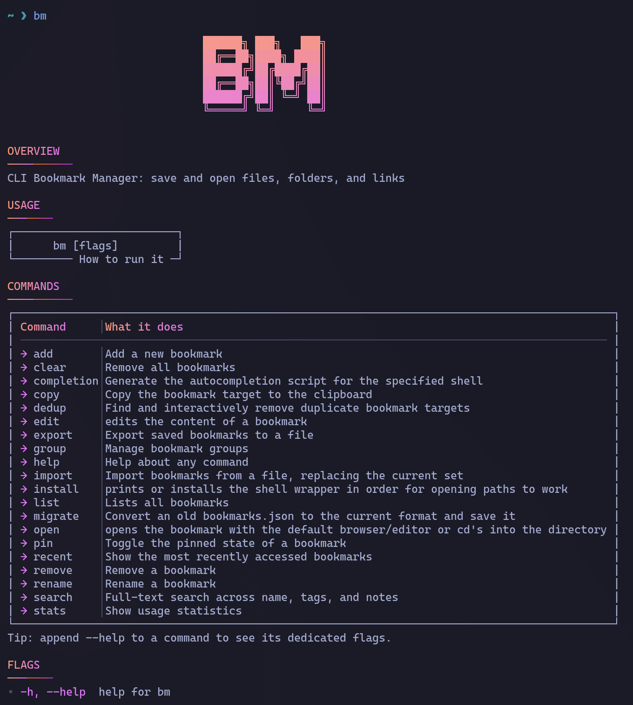
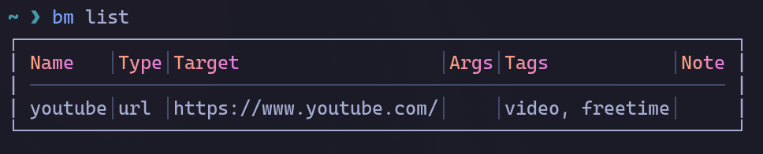
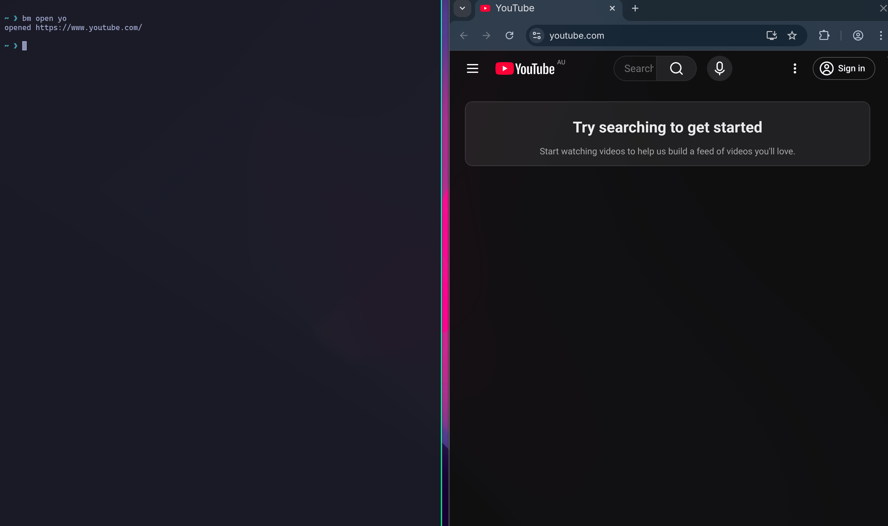

<p align="center">
  
</p>

<h1 align="center">bm — Bookmark Manager CLI</h1>

<p align="center">
  <a href="https://goreportcard.com/report/github.com/Shu-AFK/bm"></a>
  <a href="https://github.com/Shu-AFK/bm/releases"></a>
  <a href="https://github.com/Shu-AFK/bm/blob/main/LICENSE"></a>
</p>

---

**bm** is your command-line sidekick for teleporting to files, folders, and URLs in one hop.
It's fast, minimal, and keeps all bookmarks in a single human-readable JSON file under your XDG data directory.

---

# Screenshots
## Built-in help, commands, and clean terminal UI


## Add bookmarks instantly


## List bookmarks with clean formatting and colors


## Open anything, files, directories, and URLs


---

# Fuzzy search and the interactive selector

When you run:

```bash
bm open <name>
```

bm uses fuzzy matching to find the closest bookmark, even if you only type part of the name or make a typo.

If several results are similar, bm automatically shows an interactive terminal selector so you can choose the exact one you want without retyping.

This makes navigation extremely fast while still being precise.

---

# Features

- Add bookmarks quickly with `bm add <name> <path-or-url>`.
- Bookmark apps with command-line arguments using `--args`.
- Open directories, files, URLs, or launch apps with `bm open <name>`.
- Fuzzy matching for fast navigation.
- Interactive selector when fuzzy matches are close.
- List and filter bookmarks with clean table output.
- Pin important bookmarks so they always appear first.
- Attach notes to bookmarks and search across them.
- Track access history and see recently opened bookmarks.
- Rename bookmarks with automatic group reference updates.
- Organize bookmarks into named groups and open them all at once.
- Copy any bookmark target to the clipboard.
- Import browser bookmarks from Netscape HTML export files.
- Full-text search across name, tags, and notes with relevance scoring.
- Usage statistics: totals, type breakdown, top accessed, top tags.
- Deduplication: interactively remove bookmarks with duplicate targets.
- Optional shell integration for directory navigation (`cd`).
- Everything stored in human-readable JSON files.

---

# Installation

## From source (Go)

```bash
go install github.com/Shu-AFK/bm@latest
```

## Package Managers

### Homebrew (macOS & Linux)
```bash
brew install Shu-AFK/tap/bm
```

### Scoop (Windows)
```powershell
scoop bucket add bm https://github.com/Shu-AFK/scoop-bucket
scoop install bm
```

### AUR (Arch Linux)
```bash
yay -S bm-bin
```

### Debian / RPM / Arch packages
Download from the GitHub Releases page.

---

# Usage examples

### Add bookmarks
```bash
bm add docs ~/projects/docs/doc1.md
bm add homepage https://example.com --tags personal,reading
```

### Add app bookmarks with arguments
```bash
bm add vim-split vim --args="-O"
bm add ls-color ls --args="-la,--color=always"
bm add dev-server node --args="server.js,--port,3000"
```

### Open bookmarks
```bash
bm open docs
bm open home
bm open vim-split   # launches vim with -O flag
```

### List, filter, and sort
```bash
bm list
bm list --tag reading
bm list --sort type
bm list --pinned        # show only pinned bookmarks
```

### Edit bookmarks
```bash
bm edit docs --name documentation
bm edit vim-split --args="-o,-p"
bm edit docs --note "main API reference"
```

### Pin bookmarks
```bash
bm pin docs            # pin (or unpin if already pinned)
bm list --pinned       # show only pinned bookmarks
```

### Rename a bookmark
```bash
bm rename docs documentation
```

### Copy target to clipboard
```bash
bm copy homepage       # copies the URL to clipboard
```

### Search bookmarks
```bash
bm search api          # searches name, tags, and notes
```

### Recent bookmarks
```bash
bm recent              # show 10 most recently opened
bm recent --count 5    # show 5 most recently opened
```

### Groups
```bash
bm group add work docs server config   # create a group
bm group list                          # list all groups
bm group open work                     # open all bookmarks in group
bm group remove work                   # delete a group
```

### Import bookmarks
```bash
bm import backup.json                  # replace bookmarks from JSON
bm import bookmarks.html --browser     # import from browser HTML export
```

### Statistics
```bash
bm stats
```

### Deduplicate
```bash
bm dedup               # find duplicate targets and interactively remove them
```

### Remove bookmarks
```bash
bm remove docs
bm clear           # remove all bookmarks (with confirmation)
bm clear --force   # remove all without confirmation
```

### Install shell integration (either show to get the function or apply to put it directly into your profile)
```bash
bm install bash show
bm install zsh apply
bm install fish apply
```

### Shell completions
```bash
bm completion bash
bm completion zsh
bm completion fish
bm completion powershell
```

---

# Storage

Bookmarks are stored at:

```
~/.local/share/bm/bookmarks.json
```

Groups are stored at:

```
~/.local/share/bm/groups.json
```

---

# Contributing

Contributions, issues, and feature suggestions are welcome.
